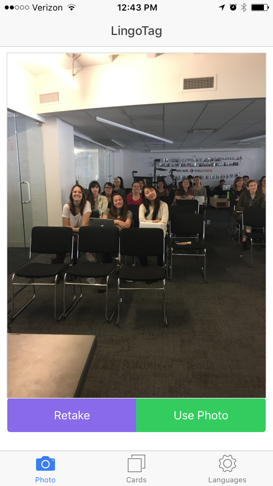
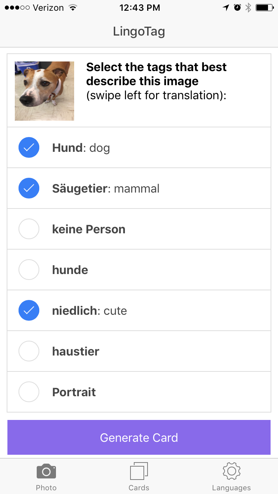
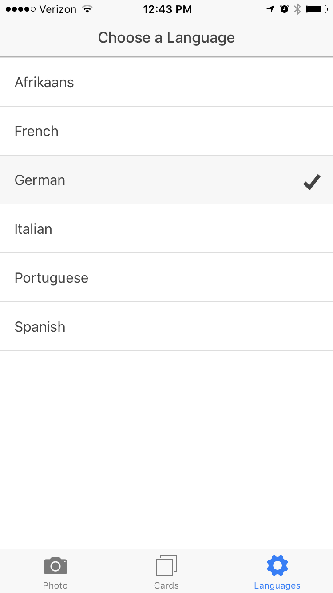

## LingoTag

#### What does it do? 
Lingotag is a mobile language learning application that allows users to learn from the world around them. Users take a photo of an object and see relevant tags for that object in one of our supported taget languages. Users can study these tags in the moment, or save them and generate a flash card deck that is based off of everyday things that they have encountered in real life.

#### What is it built with? 
LingoTag is a hybrid app built with Ionic.js. It also utilizes Clarifai's image tagging technology and Yandex translations. Version 2 of LingoTag is currently in development. It will incorporate a Firebase server that allows users to create accounts and store their flashcards more reliably. 

#### Where can I find the code? 
The code for LingoTag is in the www directory. The rest of the code comes from the ionic framework. 

#### Who made this awesome app?
This app is the brainchild of @galencorey and @verasveras.  

#### What does it look like? 
Great question! Here are some screenshots. 

